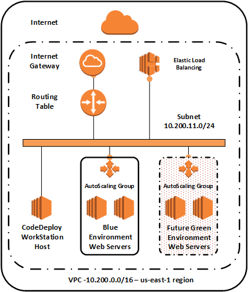
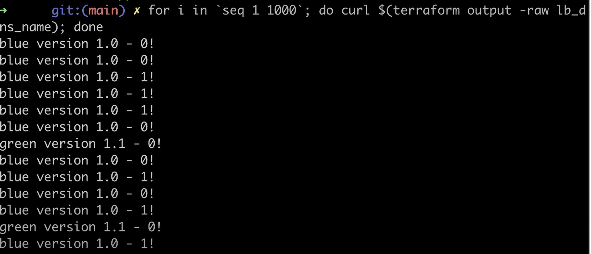

## Choosing best solution:
1. I have tried 3 types of deployment Stratergy for the task
     * Deployment using Lambda function 
     * Blue-Green Deployment 
     * ElasticBean deployment 

 Finally, I have deployed via Blue-Green deployment soloution and details as follow. 

# I have used Blue/Green Deployment strategy with AWS terraform Code Deploy
Blue green deployment reduce the downtime and risk

we are shifting the traffic from one to another and if we discover the problem in the new deployment and we can always switch to previous version. 

## In this task I'm using following Infra setup:
1. VPC
2. two private subnet with default route NAT gateway and I have launched the EC2 instance with the subnet. 
3. Also I have created the Application Load Balancer (ALB) in public subnet wit the default route to the Internal Gateway. 
4. For the ALB at least two subnet in two different Availability Zones
5. I have created the user data script once the EC2 machine Boots up. 

 ## Blue/Green Deployments 
Amazon Web Services offers services that enable organizations to leverage the power of the cloud for their development and deployment needs. AWS Code Deploy makes it possible to automate the deployment of code to either Amazon EC2 or on-premises instances. AWS Code Deploy now supports blue/green deployments. In this blog post, I will discuss the benefits of blue/green deployments and show you how to perform one.

## Steps to execute the script
1. for i in 'seq 1 1000'; do curl $(terraform output -raw lb_dns_name); done 
2. terraform apply -var 'traffic_distribution=blue-90' -var 'enable_green_env=true' -auto-approve
3. for i in 'seq 1 1000'; do curl $(terraform output -raw lb_dns_name); done 

